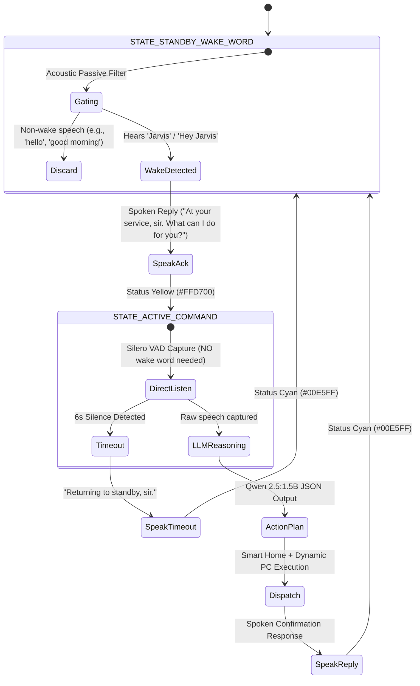

# PROJECT JARVIS v2 — Autonomous Agentic AI Workstation & Smart Automation Suite

> **Course:** BS Computer Science (3rd Year) — Artificial Intelligence (BSCS 3112 - 9420-AY126)  
> **Institution:** University of Perpetual Help System DALTA (UPHSD) — Molino Campus  
> **Faculty Lead / Professor:** Prof. Roberto L. Malitao  
> **Development Team:**  
> - **CARVAJAL, Christian Ezekiel L.** — AI Engine, State Machine & Command Automation Lead  
> - **SARSALIJO, John Miko** — Voice STT/TTS & UI/UX Design Lead  

---

## 📌 Executive Summary

**Project JARVIS v2** is a 100% offline, local-first artificial intelligence workstation and smart home automation assistant. It features:
1. **100% Pure Agentic AI Reasoning:** Zero hardcoded trigger rules, keyword dictionaries, or regex matchers. All natural language understanding, intent extraction, parameter resolution, and cross-domain tool selection are decided dynamically by local **Qwen 2.5:1.5B (Ollama)** in strict Pydantic v2 JSON schemas.
2. **Two-Turn Alternating Conversational State Machine:** Strict distinction between standby wake-word listening (`STATE_STANDBY_WAKE_WORD`) and direct command execution (`STATE_ACTIVE_COMMAND`) with 6-second timeout fallback.
3. **Dynamic Universal PC Desktop Automation Engine:** 100% portable cross-PC automation (zero hardcoded file paths) capable of launching/closing applications, deep web searching (YouTube, Spotify, GitHub, Google), controlling system audio/media, and locking the workstation.
4. **Apex Smart Home Simulator:** Real-time multi-device simulator (living room, kitchen, bedroom lights, thermostat, door lock, blinds, fan, security alarm, and entertainment unit).
5. **Modern Dark Cyberpunk Dashboard:** Real-time HUD with live status telemetry, microphone toggle, emergency HALT override, console log stream, latency counter, and model switcher.

---

## 🎓 Professor Roberto L. Malitao's Mandatory Directives

| Requirement | Implementation & Architectural Guarantee |
| :--- | :--- |
| **1. 100% Pure Agentic AI (No Hardcoded Commands)** | All user speech is forwarded directly to `ai_engine.parse_command(prompt)`. Local **Qwen 2.5:1.5B** computes multi-device action plans without any static regex or keyword matching. |
| **2. Two-Turn Conversational State Machine** | **Turn 1:** User says *"Hey Jarvis"* $\rightarrow$ JARVIS replies: *"At your service, sir. What can I do for you?"* $\rightarrow$ Transitions to active mode.<br>**Turn 2:** User gives command directly without wake word $\rightarrow$ JARVIS executes & replies $\rightarrow$ Automatically resets to standby. |
| **3. Strict Rubric Deliverables** | Preserved exact file structure: `main.py`, `src/voice_pipeline.py`, `src/ai_engine.py`, `src/home_simulator.py`, `assistant_execution.log`, and `Prelim_Project_Report.pdf`. |
| **4. Sub-2.0s Real-Time Latency** | Optimized Whisper STT (Silero VAD 350ms trailing silence auto-slicing), VRAM-pinned Qwen 2.5 inference, and streaming TTS worker. |
| **5. Strict Structured Audit Logging** | Every interaction generates an ISO 8601 timestamped record in `assistant_execution.log` containing raw transcriptions, validated JSON payloads, state transitions, and execution latency. |

---

## 🔄 Two-Turn Conversational State Machine Flow



---

## ⚡ System Capabilities Matrix

### 1. Smart Home Automation (`src/home_simulator.py`)
- **Smart Lighting:** Living room, kitchen, and bedroom lights (`turn_on`, `turn_off`, `set_brightness`).
- **Climate Control:** Thermostat (`set_temperature` with ambient thermal simulation).
- **Security & Access:** Front door lock (`lock`, `unlock`) and security alarm (`arm`, `disarm`).
- **Ambiance & Comfort:** Ceiling fan (`set_speed`), window blinds (`open`, `close`), and entertainment unit (`turn_on`, `turn_off`).

### 2. Universal PC Desktop Automation (`src/ai_engine.py`)
- **Dynamic Application Launcher:** Dynamically discovers and launches installed applications (Notepad, Calculator, Paint, Terminal, VS Code, Spotify, Brave, Chrome, Edge) via `shutil.which` and Start Menu registry scanning without hardcoded user paths.
- **Process Management:** Gracefully closes or terminates running applications via `taskkill`.
- **Deep Web Navigation & Search:** Automated browser search on Google, YouTube query search, Spotify web player, and developer portals.
- **Native OS System Controls:** Hardware volume scaling, media playback toggling, workstation lock (`rundll32.exe user32.dll,LockWorkStation`), and screen capture.

### 3. High-Precision Voice Pipeline (`src/voice_pipeline.py`)
- **Native Sound Capture:** Direct `sounddevice` stream with automatic physical microphone hardware indexing.
- **Silero VAD:** Auto-detects speech start and auto-slices audio after ~350ms of trailing silence.
- **Domain-Conditioned Faster-Whisper:** High accuracy STT with initial prompt conditioning.
- **British JARVIS TTS Engine:** Background worker thread with queue management and emergency **HALT** button override.

---

## 🚀 Quickstart Guide

### Prerequisites
1. **Python 3.10 – 3.14** installed with PATH enabled.
2. **Ollama AI Runtime** installed from [ollama.com](https://ollama.com).
   ```bash
   ollama pull qwen2.5:1.5b
   ```

### 1. Launch Project JARVIS
```powershell
# Activate local virtual environment
.\.venv\Scripts\activate

# Run main application
python main.py
```

### 2. Run Comprehensive 18/18 E2E Test Suite
```powershell
python test_system_e2e.py
```

### 3. Build Submission Zip Package
```powershell
python package_submission.py Carvajal Sarsalijo
```

---

## 📁 Repository Structure

```
project-jarvis-v2/
├── src/
│   ├── __init__.py
│   ├── main.py              # Two-Turn Conversational State Machine Coordinator
│   ├── ai_engine.py         # 100% Agentic AI Engine (Ollama Qwen 2.5) & Dynamic PC Engine
│   ├── voice_pipeline.py    # Whisper STT + Silero VAD + SoundDevice + British TTS Worker
│   └── home_simulator.py    # Apex Smart Home State Machine & Dark Cyberpunk GUI Dashboard
├── docs/
│   ├── README.md            # Documentation Directory Index
│   ├── handover.md          # Teammate & AI Assistant Handoff Guide
│   ├── rules.md             # Antigravity AI Directives & Professor Mandates
│   ├── setup.md             # Comprehensive Setup & Installation Guide
│   ├── project_plan_and_status.md # Phase Milestones & Status
│   ├── completed_task.md    # Detailed Task Execution History
│   ├── demo_guide.md        # Academic Defense Demonstration Script & Q&A
│   ├── skills.md            # Technology Stack Matrix
│   ├── changelog.md         # Version Release Notes
│   └── windows_teammate_guide.md # Windows Troubleshooting Guide
├── assistant_execution.log  # Structured ISO 8601 Execution & Performance Log
├── test_system_e2e.py       # Automated 18/18 E2E Verification Test Suite
├── package_submission.py    # Automated Final Submission Packager
├── Prelim_Project_Report.pdf# Academic Report & System Architecture Document
├── requirements.txt         # Production Dependencies
└── README.md                # Root Project Overview
```

---

## 📊 Verification Test Results

```text
===========================================================================
  ⚡ PROJECT JARVIS — UNIFIED SMART HOME & PC AUTOMATION E2E TEST SUITE
===========================================================================
  [TEST SUITE 1]: 12/12 Wake / Non-Wake Acoustic Gating Tests Passed (100%)
  [TEST SUITE 2]: 6/6 Agentic Semantic Reasoning Tests Passed (100%)
  
  OVERALL VERIFICATION RESULTS: 18/18 TESTS PASSED (100%)
  LOGGING RECORD PERSISTED TO:  assistant_execution.log
===========================================================================
```

---

## 👥 Contributors & Contact

- **Christian Ezekiel L. Carvajal** — AI Engine, State Machine Architecture & PC Automation (`christianezekielcarvajalgithub@gmail.com`)
- **John Miko Sarsalijo** — Voice Pipeline, STT/TTS Engineering & UI/UX (`johnmikosarsalijo@gmail.com`)
- **Faculty Advisor:** Prof. Roberto L. Malitao (UPHSD Molino Campus)
